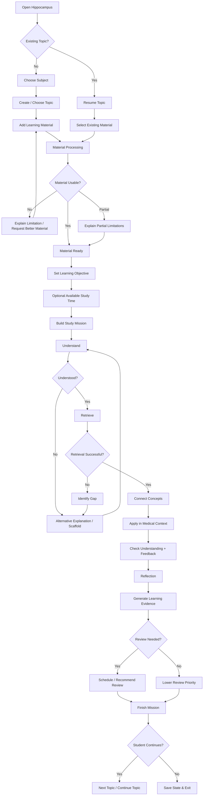
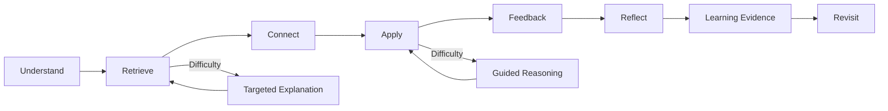
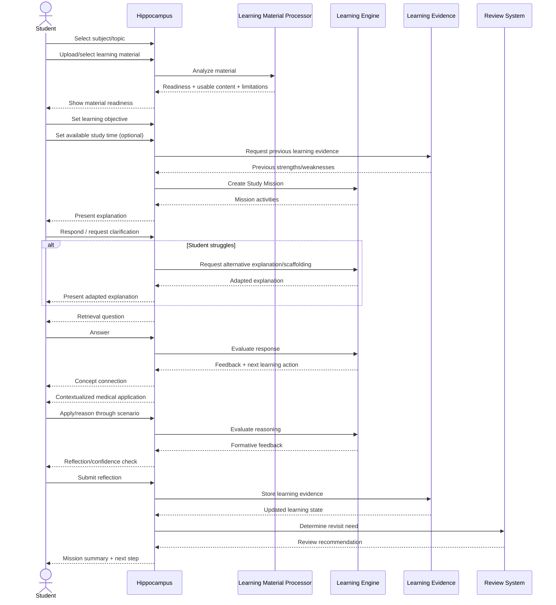
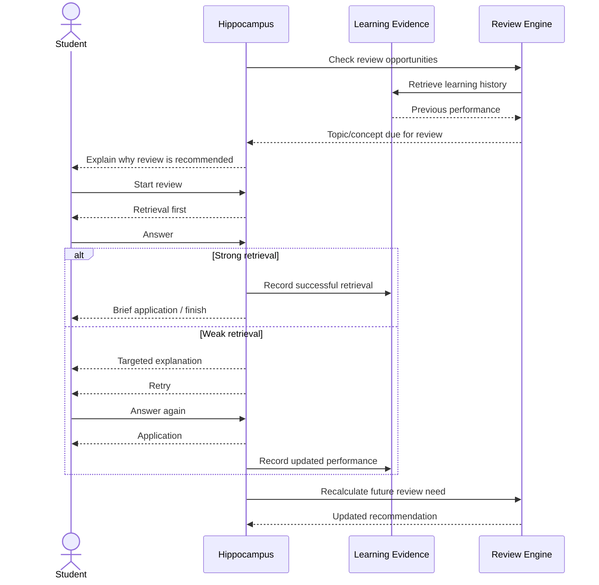
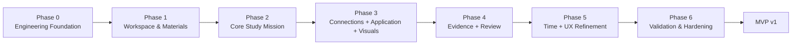

# 09 - MVP Scope & Roadmap

## 1. Purpose

This document defines what Hippocampus must deliver in its first viable release, what may be simplified, what is intentionally deferred, and in what order the product should be built and validated.

It answers:

> **What exactly are we building first, what are we intentionally postponing, and in what order should we build it?**

The MVP must be small enough to build and validate responsibly while remaining complete enough to demonstrate the educational identity established in documents 00–08.

---

# 2. Locked MVP Definition

> **The Hippocampus MVP is a student-centered medical learning application that transforms supported learning materials into guided Study Missions where students understand concepts, actively retrieve knowledge, connect related ideas, apply knowledge through appropriately scaffolded medical scenarios, receive formative feedback, build learning evidence, and revisit weak knowledge over time.**

The following boundary is equally important:

> **The MVP is not an upload-and-chat application, a PDF summarizer, an Anki replacement, or a quiz generator. Those mechanisms may exist within Hippocampus, but none of them individually defines the product.**

This definition is the scope authority for Hippocampus v1.

---

# 3. MVP Objective

The first release should validate the central product hypothesis:

> **Can a guided, evidence-based AI learning flow help medical students learn from their own study materials through understanding, retrieval, connection, application, feedback, and purposeful review?**

The MVP is not expected to implement every possible future learning capability.

It must instead deliver a coherent educational loop that is useful to medical students on its own.

If the v1 product demonstrates meaningful educational value, later releases may deepen personalization, multimodal capability, clinical simulation, and other advanced features.

---

# 4. MVP Success Definition

A student should be able to:

```text
Choose Subject
      ↓
Choose Topic
      ↓
Upload Learning Material
      ↓
Hippocampus Processes It
      ↓
Start Study Mission
      ↓
Understand
      ↓
Retrieve
      ↓
Connect
      ↓
Apply
      ↓
Receive Feedback
      ↓
See Learning Evidence
      ↓
Finish Session
      ↓
Return Later for Review
```

The MVP succeeds when this complete loop is useful, understandable, reliable within documented limits, and educationally aligned with the Educational Foundation.

---

# 5. Scope Classification

MVP capabilities are classified as:

### MUST HAVE

Without these capabilities, the product does not sufficiently represent Hippocampus.

### SHOULD HAVE

Important capabilities that should exist in v1, but whose first implementation may be intentionally lightweight.

### DEFERRED

Capabilities that may be valuable later but must not delay validation of the core educational loop.

---

# 6. Product Requirement MVP Scope

| Product Requirement | MVP Classification | v1 Boundary |
|---|---|---|
| PR-01 Subject & Topic Organization | MUST | Core subject/topic organization |
| PR-02 Multimodal Learning Material | MUST — Limited | PDF, image, text/notes, transcript text; advanced video deferred |
| PR-03 Material Understanding & Grounding | MUST | Readiness, limitations, grounding, source distinction |
| PR-04 Guided Study Mission | MUST | Central product experience |
| PR-05 Adaptive Explanation | MUST | Multiple explanation strategies and scaffolding |
| PR-06 Retrieval & Knowledge Checks | MUST | Core active retrieval formats |
| PR-07 Contextualized Application | MUST | Scaffolded practical/medical application |
| PR-08 Visual Learning | MUST — Limited | Source-image-centered visual learning |
| PR-09 Study Session & Time Management | SHOULD | Basic time-aware mission planning |
| PR-10 Learning Progress & Mastery | MUST — Basic | Learning evidence without false-precision mastery scoring |
| PR-11 Review & Spaced Relearning | MUST — Basic | Evidence-informed review and targeted relearning |
| PR-12 Educational AI Safety | MUST | Non-negotiable |
| PR-13 Learning Evidence | MUST | Foundation for continuity and review |

All thirteen approved product requirements remain represented in v1.

Some requirements are deliberately implemented at reduced depth so the MVP remains achievable without sacrificing its educational identity.

---

# 7. MVP Feature Scope

## 7.1 F-01 — Subject & Topic Workspace

### MVP Scope

Students can:

- Create/select subjects.
- Create/select topics.
- Associate materials with topics.
- View basic study history.
- Resume previous study.

Conceptual structure:

```text
Subject
   ↓
Topic
   ├── Materials
   ├── Study History
   ├── Learning Evidence
   └── Review State
```

### v1 Boundary

Avoid unnecessarily complex folder hierarchies, course-management functionality, or faculty administration.

---

## 7.2 F-02 — Learning Material Intake

### MVP Inputs

- PDF
- Images
- Plain text / pasted notes
- Transcript text

Video may initially be supported only through transcript-derived content where feasible.

### Deferred Depth

Full arbitrary video understanding is not required for v1.

Future video processing may incorporate:

```text
Video
  ↓
Transcript
+
Selected Frames
  ↓
Learning Material
```

---

## 7.3 F-03 — Material Readiness & Grounding

### MVP Scope

Material should expose clear states such as:

```text
Ready
Partially Ready
Failed
Unsupported
```

The system should communicate significant limitations rather than silently fabricating capability.

Where practical, source-grounded educational content should preserve traceability to relevant source material.

---

## 7.4 F-04 — Study Mission Builder

### MVP Scope

Mission planning may consider:

```text
Topic
+
Material
+
Learning Objective
+
Available Time
+
Existing Learning Evidence
```

The mission should select appropriate learning activities without requiring students to manually assemble tools.

---

## 7.5 F-05 — Guided Learning Player

### MVP Scope

The Study Mission is delivered through one coherent learning experience.

Primary educational functions:

```text
Understand
  ↓
Retrieve
  ↓
Connect
  ↓
Apply
  ↓
Feedback
  ↓
Reflect
```

These functions do not need to be separate pages.

---

## 7.6 F-06 — Adaptive Explanation

### MVP Explanation Capabilities

- Standard explanation
- Simpler explanation
- Step-by-step mechanism
- Analogy
- Example
- Prerequisite explanation
- Relevant visual explanation when supported

Repeated difficulty should trigger a change in instructional strategy rather than repetition of the same explanation.

---

## 7.7 F-07 — Retrieval & Knowledge Checks

### MVP Activity Types

- Recall
- Short answer
- Multiple-choice
- Explanation
- Identification
- Image identification where feasible

The MVP does not require every possible assessment format.

Anti-duplication behavior should reduce accidental repetition while preserving intentional retrieval.

---

## 7.8 F-08 — Concept Connections

### MVP Scope

Hippocampus should support meaningful relationships such as:

```text
Structure ↔ Function
Mechanism ↔ Effect
Normal ↔ Abnormal
Anatomy ↔ Physiology
Physiology ↔ Pathophysiology
Pathology ↔ Clinical Finding
```

Connections should appear inside the learning journey rather than as unnecessary information dumps.

---

## 7.9 F-09 — Contextualized Application & Cases

### MVP Scope

Contextualized application is a defining v1 capability.

Example progression:

```text
Recall
   ↓
Explain
   ↓
Connect
   ↓
Guided Application
   ↓
Short Medical Scenario
```

The MVP does not require a full virtual-patient simulator.

Scenarios should remain appropriately scaffolded for learner readiness.

---

## 7.10 F-10 — Visual Learning

### MVP Scope

Visual learning should primarily use supported source images.

Example:

```text
Source Image
    ↓
Relevant Visual Context
    ↓
Explanation
    ↓
Identification
    ↓
Structure / Function Connection
```

### Deferred Depth

- Advanced automatic segmentation
- Precise anatomical overlays
- Sophisticated interactive annotation
- Advanced medical-image interpretation

These should not block v1.

---

## 7.11 F-11 — Study Timer & Time-Aware Planning

### MVP Classification

SHOULD HAVE — Lightweight.

The student may select an available duration such as:

```text
15 min
30 min
45 min
60 min
Custom
```

The mission should adjust scope rather than claim that a universal duration is optimal.

No sophisticated time-prediction model is required.

---

## 7.12 F-12 — Progress & Learning Evidence

### MVP Scope

The system should maintain understandable evidence such as:

```text
Brachial Plexus

Recall: Strong
Understanding: Moderate
Application: Weak

Needs Review:
Clinical application
```

### v1 Boundary

Do not implement unsupported 0–100 mastery precision merely because it is visually attractive.

---

## 7.13 F-13 — Review & Spaced Relearning

### MVP Scope

```text
Initial Study
    ↓
Review Opportunity
    ↓
Retrieve First
    ↓
Assess
    ↓
Target Weakness
    ↓
Update Evidence
```

Review should not simply replay the original lesson.

The exact adaptive scheduling algorithm may remain simple in v1.

---

## 7.14 F-14 — Reflection & Confidence Capture

### MVP Classification

SHOULD HAVE — Lightweight.

Possible end-of-session reflection:

```text
Confidence:
Low / Medium / High

Anything still unclear?
```

Reflection should remain brief.

---

## 7.15 F-15 — Educational Source & AI Transparency

### MVP Scope

Where relevant, the product should distinguish:

- From your material
- AI-generated explanation
- Supplemental context
- Uncertain interpretation

This is a required safety and trust capability.

---

## 7.16 F-16 — Session Continuity & Resume

### MVP Scope

Students must be able to stop and later resume meaningful study progress.

The system should preserve:

- Topic
- Mission
- Completed activities
- Learning evidence
- Relevant unfinished work

It should avoid unnecessary replay of completed activities.

---

# 8. Explicitly Deferred Capabilities

The following capabilities must not delay the v1 MVP:

- Full video understanding
- Voice tutor
- AI oral examinations
- Interactive whiteboard
- Advanced automatic anatomy segmentation
- Advanced image highlighting and overlays
- Full virtual-patient simulation
- Advanced knowledge-graph visualization
- Highly sophisticated mastery scoring
- Predictive examination readiness
- Social features
- Study groups
- Leaderboards
- Faculty-facing tools
- Patient-facing tools
- Native mobile application
- Board-examination-specific modes
- Advanced analytics
- Multiple AI-provider switching as a user feature
- Advanced clinical simulation

Deferred does not mean rejected.

These capabilities may be reconsidered after the core educational loop has been validated.

---

# 9. MVP Student Flow



---

# 10. Study Mission Flow



The Study Mission is adaptive rather than strictly linear.

Difficulty may return the student to explanation, scaffolding, prerequisite review, or guided reasoning.

---

# 11. MVP Sequence Diagram

This sequence remains intentionally technology-agnostic.



---

# 12. Review Sequence



The review journey preserves the principle:

> **Review is not simply rereading the original lesson.**

---

# 13. Development Roadmap

## Phase 0 — Engineering Foundation

### Goal

Create a stable development foundation.

### Scope

- Project/repository foundation
- Frontend/backend application skeleton
- Environment configuration
- Local development workflow
- Error-handling conventions
- Testing foundation
- Basic observability
- Development standards required for subsequent phases

### Exit Condition

> The application foundation runs reliably and is ready for product development.

---

## Phase 1 — Learning Workspace & Materials

### Goal

Allow students to organize learning and provide supported source material.

### Primary Features

- F-01
- F-02
- F-03
- F-15 partial

### Scope

- Subjects
- Topics
- Material association
- PDF intake
- Image intake
- Text/notes intake
- Transcript intake
- Processing states
- Material readiness
- Source association
- Processing limitation feedback

### Exit Condition

A student can create:

```text
Anatomy
  ↓
Brachial Plexus
  ↓
Upload Material
  ↓
See Whether Hippocampus Can Use It
```

---

## Phase 2 — Core AI Tutor & Study Mission

### Goal

Prove the central guided learning experience.

### Primary Features

- F-04
- F-05
- F-06
- F-07
- F-16

### Scope

- Learning objective
- Study Mission generation
- Guided learning player
- Explanation
- Simplification
- Step-by-step explanation
- Analogy/example
- Retrieval questions
- Basic formative feedback
- Session progress
- Resume behavior

### Exit Condition

The first meaningful internal prototype supports:

```text
Material
  ↓
Study Mission
  ↓
Understand
  ↓
Retrieve
```

This is an internal prototype, not yet the complete Hippocampus MVP.

---

## Phase 3 — Connections, Visual Learning & Practical Application

### Goal

Deliver the capabilities that distinguish Hippocampus from a generic AI study assistant.

### Primary Features

- F-08
- F-09
- F-10

### Scope

- Concept connections
- Cross-concept reasoning
- Source-image use
- Image-based questions where feasible
- Contextualized examples
- Mechanism-to-finding relationships
- Foundational clinical scenarios
- Guided reasoning
- Application feedback

### Exit Condition

The learning flow supports:

```text
Understand
  ↓
Retrieve
  ↓
Connect
  ↓
Apply
```

This milestone forms the basis of the **Alpha** release.

---

## Phase 4 — Learning Evidence & Review

### Goal

Make learning continue across sessions.

### Primary Features

- F-12
- F-13
- F-14

### Scope

- Topic/concept learning evidence
- Retrieval performance
- Application performance
- Basic confidence
- Weak-concept identification
- Review recommendation
- Spaced review
- Review rationale
- Targeted relearning

### Exit Condition

Hippocampus remembers meaningful **learning evidence**, not merely conversations or content completion.

The complete educational loop now exists:

```text
Understand
  ↓
Retrieve
  ↓
Connect
  ↓
Apply
  ↓
Feedback
  ↓
Evidence
  ↓
Revisit
```

---

## Phase 5 — Time-Aware Missions & UX Refinement

### Goal

Make the complete educational loop practical for everyday student use.

### Primary Features

- F-11
- F-16 refinement
- Cross-feature UX refinement

### Scope

- Available study time
- Mission scope adjustment
- Study timer
- Appropriate stopping points
- Improved continuation
- Reduced unnecessary setup
- Navigation refinement
- Focused Study Mission experience
- Error-state refinement

### Exit Condition

The application is sufficiently coherent and practical for regular medical-student study.

This milestone forms the basis of the **Beta** release.

---

## Phase 6 — MVP Validation & Hardening

### Goal

Determine whether the complete v1 product is sufficiently safe, reliable, usable, and educationally valuable for MVP release.

### Focus

- AI evaluation
- Medical-content accuracy
- Groundedness
- Source fidelity
- Question quality
- Clinical-scenario quality
- Visual-learning reliability
- User-flow testing
- Performance
- Accessibility
- Security
- Privacy
- Reliability
- Failure testing
- Medical-student feedback

### Scope Rule

No major new product features should be introduced during this phase unless required to resolve a release-blocking issue.

### Exit Condition

> **MVP v1 Release Candidate**

---

# 14. Development Flow



---

# 15. Release Milestones

## Internal Prototype — End of Phase 2

Provides:

```text
Upload / Material
       ↓
Study Mission
       ↓
Understand
       ↓
Retrieve
```

Useful for validating the basic AI tutoring and mission concept internally.

It is **not** considered the Hippocampus MVP.

---

## Alpha — End of Phase 3

Adds:

```text
Connect
+
Apply
+
Visual Learning
```

At this point, Hippocampus begins demonstrating its distinct educational identity.

A very small controlled group of medical students may be appropriate for early feedback.

---

## Beta — End of Phase 4 / Phase 5

Adds:

```text
Learning Evidence
+
Review
+
Time-Aware Study
+
Refined Continuity
```

The complete educational loop is now available for broader validation.

---

## MVP v1 — After Phase 6

The MVP release occurs only after validation and hardening of the complete learning loop.

```text
Internal Prototype
       ↓
Alpha
       ↓
Beta
       ↓
Validation & Hardening
       ↓
MVP v1
```

---

# 16. Minimum Viable Hippocampus Boundary

A technically functional application could exist after Phase 2.

However, Phase 2 alone would primarily provide:

```text
Upload
  ↓
Explain
  ↓
Retrieve / Quiz
```

That is insufficient to represent the product defined in documents 00–08.

The minimum acceptable Hippocampus educational identity requires at least:

```text
Materials
+
Understand
+
Retrieve
+
Connect
+
Apply
+
Feedback
+
Learning Evidence
+
Revisit
```

Therefore, the v1 MVP release boundary includes the complete educational loop rather than stopping at basic AI tutoring.

---

# 17. MVP Validation Measures

MVP validation should not rely solely on:

> "Do students like the app?"

Evaluation should consider multiple levels.

## 17.1 Learning Signals

Potential measures include:

- Retrieval performance
- Later retrieval/retention
- Application performance
- Recurring misconceptions
- Improvement following corrective explanation
- Ability to connect related concepts

## 17.2 Learning Behavior Signals

Potential measures include:

- Engagement with retrieval
- Use of review opportunities
- Retry after feedback
- Progression from explanation to application
- Reflection participation where useful

## 17.3 Experience Signals

Potential measures include:

- Study Mission completion
- Time required to begin meaningful study
- Unnecessary interruptions
- Student-rated clarity
- Student-rated usefulness
- Perceived cognitive burden
- Ease of resuming study

## 17.4 AI Quality Signals

Potential measures include:

- Source fidelity
- Factual error rate
- Unsupported claims
- Groundedness
- Explanation quality
- Question quality
- Clinical-scenario quality
- Visual interpretation quality
- Latency
- Failure behavior

Detailed evaluation design belongs to **15 - AI Evaluation Strategy**.

---

# 18. MVP Non-Functional Priorities

## Critical

- AI grounding and source fidelity
- AI uncertainty handling
- Educational safety
- Student data isolation
- Secure file handling
- Learning evidence integrity
- Session continuity
- Material-processing transparency
- Safe failure behavior

## High

- AI response latency
- Interface responsiveness
- Accessibility of core flows
- Maintainability
- Observability
- Question quality
- Case quality
- Visual reliability

## Medium for Initial MVP

- Large-scale scalability
- Advanced availability architecture
- Sophisticated product analytics
- Enterprise-level deployment redundancy

The v1 priority is:

> **Correct and coherent learning experience before large-scale optimization.**

---

# 19. MVP Exit Criteria

Hippocampus must not be labeled **MVP v1** until the following product-level conditions are satisfied:

1. A student can complete the full Study Mission learning loop.
2. Supported PDF, text/transcript, and image learning works reliably within documented limits.
3. Material-readiness limitations are visible.
4. Generated explanations can be grounded to source material when expected.
5. Students receive active retrieval opportunities.
6. Students encounter meaningful concept connections.
7. Students can apply knowledge through appropriately scaffolded medical scenarios.
8. Relevant supported source visuals can participate in learning.
9. Formative feedback helps explain errors or reasoning gaps.
10. Learning evidence persists across sessions.
11. Review can revisit previously studied concepts.
12. Review provides a meaningful rationale.
13. Accidental repetition is reasonably controlled.
14. Intentional spaced retrieval remains supported.
15. Students can stop and resume learning.
16. AI uncertainty and important limitations are communicated.
17. Critical privacy and security behavior is tested.
18. Core flows meet the selected accessibility baseline.
19. AI educational evaluation reaches an agreed acceptance threshold.
20. A small medical-student pilot indicates that the complete learning flow is understandable and useful.

Meeting technical functionality alone is insufficient if the educational experience does not meet these criteria.

---

# 20. Post-MVP Product Principle

Once v1 is complete, future development should be driven by evidence from real product use and educational evaluation.

The intended progression is:

```text
MVP v1
   ↓
Validate Educational Value
   ↓
Identify Real Learner Problems
   ↓
Improve Core Experience
   ↓
Add Advanced Capabilities Where Justified
```

Future development should not add complexity simply because a capability is technically possible.

The key question after v1 remains:

> **Does this improve how medical students understand, retrieve, connect, apply, or retain knowledge?**

---

# 21. Future Roadmap Direction

Potential post-MVP progression:

```text
MVP v1
   ↓
v1.x
Quality, Reliability & Evidence-Based Refinement
   ↓
v2
Advanced Adaptive Learning
   ↓
v3
Advanced Visual Medicine
   ↓
v4
Voice & Oral Examination
   ↓
v5
Advanced Clinical Simulation
```

Potential future capabilities include:

- Voice tutoring
- Oral examinations
- Advanced interactive diagrams
- Automatic anatomy highlighting
- Advanced knowledge graphs
- Full video understanding
- Virtual patients
- More sophisticated adaptive review
- Exam-preparation modes
- Native mobile applications

These are roadmap possibilities rather than current commitments.

---

# 22. Scope Change Rule

Any proposed capability that expands the v1 boundary should answer:

1. Which documented problem does it solve?
2. Which Educational Foundation principle supports it?
3. Which approved Product Requirement authorizes it?
4. Which learner state or journey stage requires it?
5. Why is it necessary before MVP validation?
6. What existing MVP work would it delay?

If those questions cannot be answered convincingly, the capability should remain deferred.

This protects the MVP from uncontrolled scope growth.

---

# 23. Roadmap Traceability

| Phase | Primary Feature Groups | Educational Outcome |
|---|---|---|
| Phase 0 | Foundation | Enables reliable development |
| Phase 1 | F-01, F-02, F-03, F-15 partial | Establish trustworthy learning context |
| Phase 2 | F-04, F-05, F-06, F-07, F-16 | Understand + Retrieve |
| Phase 3 | F-08, F-09, F-10 | Connect + Apply |
| Phase 4 | F-12, F-13, F-14 | Evidence + Revisit |
| Phase 5 | F-11, F-16 refinement | Practical everyday study flow |
| Phase 6 | All MVP capabilities | Validate and harden complete loop |

---

# 24. Constraints

The roadmap assumes:

- The project will initially prioritize a web application.
- AI capability and multimodal processing may be constrained by provider quotas, rate limits, latency, model capability, and free-tier capacity.
- Full video processing is not necessary to validate the core product hypothesis.
- Sophisticated personalization requires sufficient learning evidence and therefore should evolve after initial use.
- Medical-content quality requires explicit evaluation.
- Visual capabilities may initially be narrower than long-term ambitions.
- MVP scope must remain feasible without compromising core educational safety.

Technical architecture may refine implementation sequencing but must not silently change the approved product boundary.

---

# 25. Out of Scope

This document does not select:

- Java/Spring Boot architecture
- Frontend architecture
- Specific AI model
- AI provider/model routing and configuration
- RAG implementation
- Embedding model
- Vector database
- Relational database
- API contracts
- Authentication implementation
- Infrastructure
- Deployment provider
- Detailed database schema
- Exact mastery algorithm
- Exact spaced-review algorithm
- Exact prompt strategy

Those decisions belong to subsequent architecture documents.

---

# 26. Related Documents

- README - Documentation Guide
- 00 - Project Vision
- 01 - Guiding Principles
- 02 - Problem Statement
- 03 - Educational Foundation
- 04 - Product Requirements
- 05 - User Personas
- 06 - User Journey & Learning Flow
- 07 - Feature Specifications
- 08 - Non-Functional Requirements
- 10 - AI Architecture
- 15 - AI Evaluation Strategy

---

# 27. Next Document

**10 - AI Architecture**

With the product and MVP boundary established, the next document should determine how AI supports Hippocampus without becoming the sole authority for educational state or business logic.

This is where the project can formally evaluate and define:

- External AI provider strategy
- Ollama API + Google Gemini API
- Model responsibilities
- AI orchestration
- Grounding
- Retrieval
- Structured AI outputs
- AI boundaries
- Model fallback behavior
- Resource constraints
- Integration with the future Spring Boot architecture

The AI architecture must implement the educational product defined in documents 00–09 rather than redefining it.

---

# 28. Revision History

| Version | Date | Author | Changes |
|---|---|---|---|
| 1.1.0 | 2026-08-24 | Project Hippocampus Team | Final consistency patch updating obsolete local-compute/Ollama assumptions to the approved external dual-provider architecture while preserving the v1 product boundary. |
| 1.0.0 | 2026-08-23 | Project Hippocampus Team | Initial finalized MVP Scope & Roadmap defining the complete v1 educational loop, phased implementation, release milestones, validation requirements, and post-MVP boundary |

---

# 29. Approval

**Status:** Final

**Reviewed By:** Project Hippocampus Team

**Approved By:** Project Hippocampus Team
