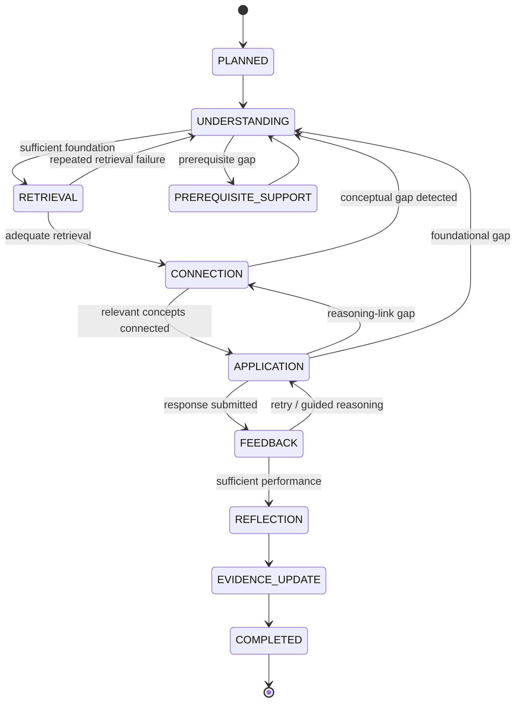
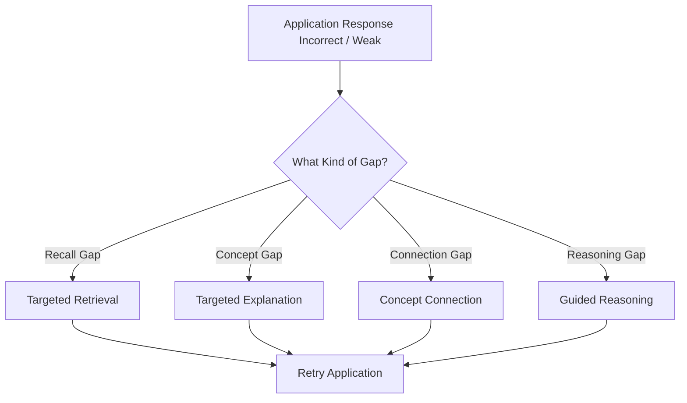
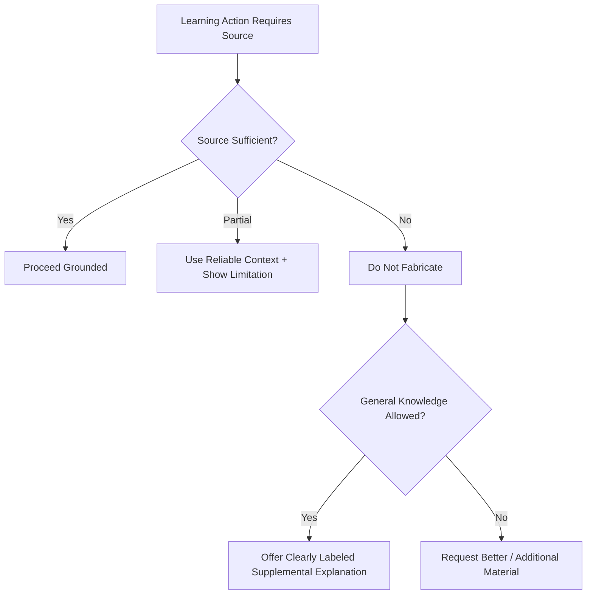
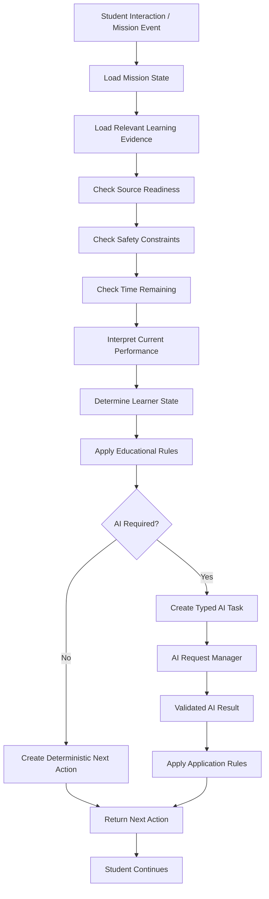
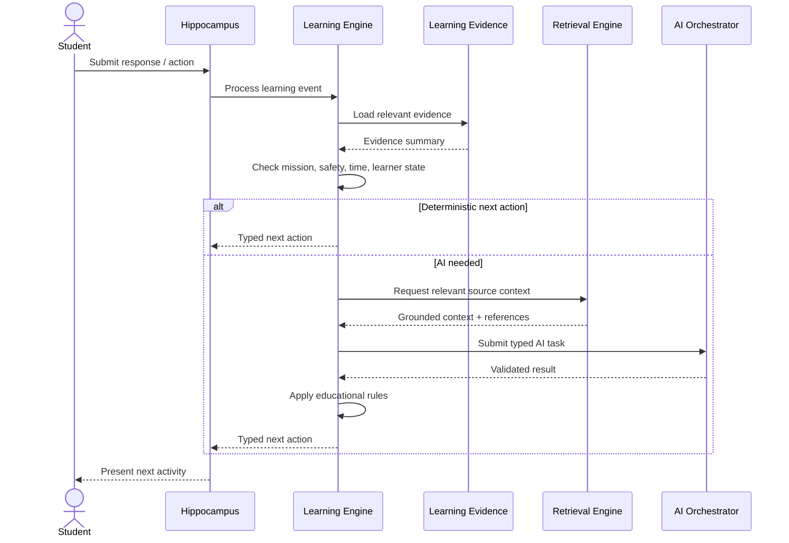

# 11 - AI Learning Engine

## 1. Purpose

This document defines the educational decision engine of Hippocampus.

It answers:

> **How does Hippocampus decide what the student should do next?**

The Learning Engine sits above the LLM.

It interprets:

- Study Mission state
- Learner state
- Learning evidence
- Current performance
- Available study time
- Source-material readiness
- Educational rules
- Review state
- Prior activity history

and then determines the next educational action.

The LLM may generate content for an action.

The Learning Engine decides whether that action should happen.

---

# 2. Locked Principle

> **The Learning Engine is the educational decision authority. The LLM is a content-generation and interpretation service.**

Therefore:

```text
Student Response
      ↓
Learning Engine
      ↓
Educational Rules
      ↓
Evidence / Mission State
      ↓
Choose Next Action
      ↓
Invoke AI only if needed
```

Not:

```text
Student Response
      ↓
LLM decides entire learning journey
```

This distinction is foundational for:

- Predictability
- Explainability
- Safety
- Testability
- Lower AI usage
- Long-term maintainability

---

# 3. Learning Engine Responsibilities

The Learning Engine owns:

- Study Mission progression
- Current mission stage
- Learner-state interpretation
- Next-action selection
- Activity eligibility
- Difficulty progression
- Retry decisions
- Prerequisite fallback
- Anti-repetition rules
- Time-aware scope decisions
- Learning-evidence updates
- Review eligibility
- Review priority
- Session completion decisions
- AI task selection
- AI task priority
- Safe fallback behavior
- Explainability of important learning decisions

The Learning Engine does **not** directly generate rich natural-language educational content.

That responsibility belongs to AI tasks.

---

# 4. Inputs to the Learning Engine

A next-action decision should consider only relevant context.

Conceptually:

```text
Learner Context
+
Mission Context
+
Current Activity
+
Current Response
+
Learning Evidence
+
Review Evidence
+
Available Time
+
Source Readiness
+
Recent Activity History
+
Educational Rules
        ↓
NEXT LEARNING ACTION
```

## 4.1 Learner Context

May include:

- Learner state
- Current educational stage where known
- Explicit study objective
- Current confidence signal
- Current confusion signal

## 4.2 Mission Context

May include:

- Subject
- Topic
- Learning objective
- Current mission stage
- Mission completion state
- Planned activity sequence
- Remaining mission scope

## 4.3 Learning Evidence

May include:

- Prior retrieval performance
- Application performance
- Visual identification performance
- Repeated misconceptions
- Previous review results
- Confidence
- Recent error patterns

## 4.4 Source Context

May include:

- Material readiness
- Available grounded chunks
- Relevant source visuals
- Source limitations

## 4.5 Time Context

May include:

- Available study time
- Time remaining
- Session age
- Whether the mission should narrow scope

---

# 5. Output of the Learning Engine

The engine should return a typed educational action.

Conceptually:

```text
NEXT_ACTION
```

Possible action categories include:

- PRESENT_EXPLANATION
- PRESENT_SIMPLER_EXPLANATION
- PRESENT_PREREQUISITE
- PRESENT_WORKED_EXAMPLE
- ASK_RETRIEVAL_QUESTION
- ASK_CONNECTION_QUESTION
- PRESENT_CONCEPT_CONNECTION
- ASK_APPLICATION_QUESTION
- PRESENT_CLINICAL_SCENARIO
- GIVE_FORMATIVE_FEEDBACK
- RETRY_ACTIVITY
- REDUCE_DIFFICULTY
- INCREASE_DIFFICULTY
- USE_VISUAL_ACTIVITY
- REQUEST_REFLECTION
- UPDATE_EVIDENCE
- COMPLETE_MISSION
- RECOMMEND_REVIEW
- RESUME_MISSION
- STOP_FOR_TIME_LIMIT
- COMMUNICATE_SOURCE_LIMITATION
- SAFE_FALLBACK

Each action should have a reason.

---

# 6. Next-Action Decision Hierarchy

The Learning Engine should evaluate decisions in a consistent order.

Recommended precedence:

```text
1. Safety / Source Constraints
2. Session / Time Constraints
3. Current Misunderstanding
4. Retrieval Performance
5. Application Performance
6. Learner-State Adaptation
7. Mission Progression
8. Reflection
9. Evidence Update
10. Review / Completion
```

This prevents lower-priority goals from overriding critical constraints.

Example:

If a source image is unreadable, the system should not generate an image-identification task simply because the mission plan originally included one.

---

# 7. Rule Precedence

## Priority 1 — Safety

Examples:

- Source insufficient
- AI output invalid
- Clinical boundary crossed
- Visual interpretation unreliable

Safety rules override all learning-flow preferences.

---

## Priority 2 — Source Reliability

If the learning activity depends on unavailable source information:

```text
Required Source Missing
      ↓
Communicate Limitation
      ↓
Choose Safe Alternative
```

The system must not fabricate missing material.

---

## Priority 3 — Time Constraint

When little time remains:

```text
Time Remaining Low
      ↓
Do Not Start Large New Branch
      ↓
Prioritize Current Learning Objective
      ↓
Finish / Record Evidence
      ↓
Preserve Unfinished Work
```

---

## Priority 4 — Corrective Learning

Repeated misunderstanding should take precedence over planned progression.

```text
Planned Next:
Application

But:
Student cannot retrieve foundational mechanism

Therefore:
Targeted explanation / prerequisite
```

---

## Priority 5 — Educational Progression

Only after safety, source, time, and corrective concerns are resolved should the engine continue toward deeper learning.

---

# 8. Canonical Mission-State Model

The Study Mission may move through:

```text
PLANNED
  ↓
UNDERSTANDING
  ↓
RETRIEVAL
  ↓
CONNECTION
  ↓
APPLICATION
  ↓
FEEDBACK
  ↓
REFLECTION
  ↓
EVIDENCE_UPDATE
  ↓
COMPLETED
```

However, transitions are not strictly linear.

Examples:

```text
RETRIEVAL
   ↓ failure
UNDERSTANDING
```

```text
APPLICATION
   ↓ reasoning gap
CONNECTION
```

```text
UNDERSTANDING
   ↓ prerequisite gap
PREREQUISITE_SUPPORT
```

---

# 9. Mission State Diagram



---

# 10. Learner-State Interpretation

The Learning Engine should use the seven learning states defined in 05 as **contextual signals**, not permanent labels.

## LS-01 — New Topic

Engine behavior:

- More explanation
- More scaffolding
- Basic retrieval first
- Lower initial application complexity
- Relevant visuals when needed

---

## LS-02 — Time-Constrained

Engine behavior:

- Narrow scope
- Prioritize high-value activities
- Avoid unnecessary expansion
- Preserve unfinished work
- Complete with evidence summary

---

## LS-03 — Concept-Struggling

Engine behavior:

```text
Alternative Explanation
      ↓
Prerequisite Check
      ↓
Smaller Conceptual Step
      ↓
Worked Example
      ↓
Retry
```

---

## LS-04 — Memorization-Heavy

Engine behavior:

- Reduce repetitive basic recall
- Increase connection tasks
- Increase explanation prompts
- Increase application
- Ask why/how, not only what

---

## LS-05 — Visual / Spatial Task

Engine behavior:

- Prioritize relevant visual context
- Use identification where appropriate
- Link image to concept
- Avoid text-only replacement when visual information is essential

---

## LS-06 — Review & Retention

Engine behavior:

- Retrieve first
- Minimal re-teaching
- Target weak concepts
- Reduce already-strong material
- Update review evidence

---

## LS-07 — Self-Directed Study

Engine behavior:

- Respect explicit objective
- Structure activity sequence
- Avoid unnecessary override of user intent
- Recommend, not over-control

---

# 11. New Topic Decision Policy

For a new topic:

```text
New Topic
   ↓
Is source ready?
   ├── No → Source limitation
   └── Yes
        ↓
Establish foundational concepts
        ↓
Present concise explanation
        ↓
Check understanding
        ↓
Basic retrieval
        ↓
Relevant connection
        ↓
Light application
```

The engine should not begin with advanced clinical reasoning unless the learner context justifies it.

---

# 12. Concept-Struggling Policy

Repeated difficulty should trigger progressive support.

Example rule path:

```text
First Failure
   ↓
Targeted Feedback

Second Failure
   ↓
Alternative Explanation

Third Failure
   ↓
Prerequisite Check

Still Failing
   ↓
Worked Example / Smaller Step

Then
   ↓
Retry
```

The exact number of attempts should remain configurable and should not become a rigid universal educational law.

The principle is:

> **Change the instructional strategy before simply increasing question volume.**

---

# 13. Retrieval Decision Policy

The engine should determine:

- Whether retrieval is appropriate now
- Which concept should be retrieved
- Whether the student has seen a similar question recently
- Whether intentional repetition is justified
- Appropriate question difficulty
- Whether deterministic scoring is possible

## Retrieval Before Re-Teaching

For review sessions:

```text
Previously Learned Concept
        ↓
Retrieve First
        ↓
Then decide whether re-teaching is needed
```

This is a core evidence-based rule.

---

# 14. Anti-Repetition Engine

The Learning Engine should track recent activity signatures.

A conceptual activity signature may include:

```text
Concept
+
Activity Type
+
Question Intent
+
Difficulty
+
Session
```

The engine should distinguish:

## Accidental Repetition

- Same fact tested repeatedly
- Superficial rewording
- Same explanation strategy repeated after failure
- Duplicate mission setup

## Intentional Repetition

- Spaced retrieval
- Corrective retry
- Reassessment after explanation
- Review of previously weak knowledge

Decision principle:

```text
Repeated Activity Requested
      ↓
Educational Purpose?
      ├── No → Suppress / Choose Alternative
      └── Yes → Allow
```

---

# 15. Connection Decision Policy

The engine should introduce a concept connection when:

- The student has sufficient foundational understanding
- The relationship meaningfully improves understanding
- The connection supports future application
- The connection does not create unnecessary complexity

Examples:

```text
Anatomy → Function
Physiology → Pathophysiology
Mechanism → Symptom
Drug Mechanism → Effect
```

Do not add cross-subject links solely to make content appear comprehensive.

---

# 16. Application Decision Policy

Application should be introduced only when prerequisite evidence is sufficient.

Conceptual readiness:

```text
Foundational Understanding
+
Adequate Retrieval
+
Relevant Connections
        ↓
Application
```

Application levels may progress:

```text
Direct Example
   ↓
Guided Application
   ↓
Mechanism-to-Finding
   ↓
Short Scenario
   ↓
Structured Case Reasoning
```

If application fails, the engine should diagnose whether the gap is:

- Recall
- Conceptual understanding
- Connection
- Reasoning

and route accordingly.

---

# 17. Application Failure Routing



This is preferable to simply saying:

> Wrong. The answer is X.

---

# 18. Feedback Decision Policy

Feedback should be proportional to the learner's need.

Possible feedback depth:

```text
Correct
  ↓
Brief confirmation + key rationale

Partially Correct
  ↓
Identify correct reasoning
+
Highlight missing concept
+
Retry if useful

Incorrect
  ↓
Identify reasoning gap
+
Targeted support
+
Retry
```

The engine should avoid giving long explanations after every correct response.

This reduces cognitive load and AI usage.

---

# 19. Difficulty Adaptation

Difficulty should change based on evidence, not arbitrary randomness.

Possible levels:

- Foundational
- Intermediate
- Applied

These are broad educational categories, not permanent learner levels.

Example:

```text
Repeated Strong Retrieval
      ↓
Increase Connection / Application Complexity
```

```text
Repeated Weak Retrieval
      ↓
Reduce Complexity
+
Increase Scaffolding
```

The system should avoid rapid oscillation after a single response.

---

# 20. Time-Aware Decision Policy

Time is a constraint on scope, not a measure of mastery.

If:

```text
Available Time = 15 minutes
```

the engine should:

- Narrow topic scope
- Reduce low-priority expansion
- Preserve at least one active retrieval opportunity where feasible
- Avoid beginning a large new scenario near session end
- Save unfinished work
- Generate a clear continuation state

It should not:

- Speed through every stage
- Skip all retrieval merely to "finish"
- Claim the topic is complete because time expired

---

# 21. Time-Remaining Rules

Conceptually:

```text
Plenty of Time
   ↓
Normal mission progression

Moderate Time Remaining
   ↓
Prioritize current learning objective

Low Time Remaining
   ↓
Finish current educational unit
   ↓
Evidence update
   ↓
Save continuation
```

Exact time thresholds are implementation configuration, not educational constants.

---

# 22. Visual Activity Policy

A visual activity may be selected when:

- Visual information is central to the learning objective
- A relevant source image exists
- The image is sufficiently interpretable
- The activity does not expose an unsupported visual conclusion

If image interpretation is uncertain:

```text
Visual Needed
   ↓
Image Not Reliably Interpretable
   ↓
Communicate Limitation
   ↓
Use Safe Alternative
```

The engine must not silently convert a failed visual task into a confident text claim.

---

# 23. AI Invocation Policy

The Learning Engine should ask:

> **Does the next action require generative intelligence?**

If no:

```text
Use Deterministic Logic
```

If yes:

```text
Create Typed AI Task
   ↓
AI Request Manager
   ↓
Validated AI Result
```

Examples that usually do **not** require AI:

- Timer
- Resume
- Review eligibility
- Existing progress retrieval
- Simple MCQ scoring
- Duplicate detection
- Navigation
- Saved content display

---

# 24. AI Task Selection Matrix

| Learning Need | Preferred AI Task |
|---|---|
| Needs explanation | AI-01 Explanation |
| Needs retrieval question | AI-02 Retrieval Question |
| Open-ended response evaluation | AI-03 Response Evaluation |
| Needs concept relationship | AI-04 Connection |
| Ready for practical application | AI-05 Contextualized Application |
| Natural-language reflection | AI-06 Reflection Interpretation |
| Mission activity suggestion | AI-07 Mission Planning Assistance |

The Learning Engine chooses the task.

The LLM does not choose its own task type.

---

# 25. AI Response Integration

Validated AI output should be interpreted through application rules.

Example:

```text
AI Evaluation:
PARTIAL
Missing Concept:
posterior cord motor relationship
Recommended Action:
TARGETED_EXPLANATION
```

Then the Learning Engine decides:

```text
Is targeted explanation valid here?
Is enough time available?
Was this already attempted?
Is prerequisite support more appropriate?
```

Only then is the next activity created.

---

# 26. Evidence Update Policy

Learning evidence should be updated only after a meaningful event.

Examples:

- Retrieval response
- Application response
- Corrective retry
- Review response
- Reflection
- Visual identification

Not every click should become learning evidence.

---

# 27. Evidence Event Model

Conceptually:

```text
Evidence Event
├── concept
├── topic
├── activityType
├── outcome
├── difficulty
├── attemptNumber
├── confidence
├── sourceContext
├── timestamp
└── sessionId
```

The exact data model belongs to later domain/database documentation.

---

# 28. Evidence Aggregation Principle

The engine should avoid declaring mastery from one event.

Conceptually:

```text
Multiple Evidence Events
        ↓
Application Rules
        ↓
Current Learning Evidence Summary
```

Possible summary labels:

- Strong
- Developing
- Weak
- Insufficient Evidence

These should remain explainable.

---

# 29. Confidence Interpretation

Confidence should be used as a secondary signal.

Example:

```text
High Confidence
+
Incorrect Application
        ↓
Potential Misconception
```

```text
Low Confidence
+
Repeated Correct Retrieval
        ↓
Possible Underconfidence
```

Confidence should not override actual performance.

---

# 30. Review Decision Policy

Review eligibility should use deterministic or explicit application rules.

Possible signals:

- Time since last study
- Prior retrieval quality
- Application quality
- Repeated errors
- Confidence mismatch
- Review history

The exact spacing algorithm is deferred.

---

# 31. Review Priority

Conceptually:

```text
Weak + Recent Error
        ↓
Higher Review Priority

Strong + Repeated Success
        ↓
Lower Review Priority
```

The system should preserve intentional spaced retrieval even for strong concepts when appropriate.

---

# 32. Explainable Review

The engine should produce a human-readable reason for review.

Example:

> You recalled the posterior cord correctly but struggled to connect the injury to wrist-drop findings, so application is being reviewed.

The reason should come from stored learning evidence, not invented explanation.

---

# 33. Mission Completion Policy

A mission may complete when:

- The bounded objective has been sufficiently addressed
- Required core activities are finished
- Time constraints require stopping
- The student explicitly stops
- The engine records remaining gaps
- Continuation/review state is preserved

Completion must not imply mastery.

---

# 34. Stop / Resume Policy

When a student stops:

```text
Current Mission
   ↓
Persist Completed Activities
Persist Evidence
Persist Current Stage
Persist Remaining Work
   ↓
Resume Later
```

On resume:

- Do not replay setup unnecessarily.
- Do not repeat completed activities without reason.
- Allow retrieval repetition if elapsed time makes it educationally justified.

---

# 35. Safe Fallback Rules

When AI fails:

## Explanation Failure

Use:

- Previously validated explanation where appropriate
- Source-derived fallback
- Transparent retry option

## Question Generation Failure

Use:

- Existing validated question
- Deterministic activity if possible
- Skip safely if necessary

## Evaluation Failure

Do not update evidence from an unvalidated AI interpretation.

## Scenario Failure

Return to a simpler supported application activity.

## RAG Failure

Do not claim source grounding.

---

# 36. Source-Limitation Routing



---

# 37. Learning Engine Decision Flow



---

# 38. Core Decision Sequence



---

# 39. Rule Engine vs LLM

A key architectural boundary:

## Rule Engine / Application

Determines:

- What stage
- What activity type
- Why now
- Difficulty direction
- Review need
- Retry behavior
- Time-bound scope
- Evidence interpretation
- Safety boundary

## LLM

Produces:

- The explanation text
- The generated question
- The case wording
- The natural-language feedback
- The concept-connection wording

This architecture ensures model replacement does not redefine pedagogy.

---

# 40. Determinism Strategy

Not every decision must be mathematically deterministic, but core product behavior should be rule-driven enough to test.

Examples of deterministic rules:

```text
IF review session
THEN retrieval before re-teaching
```

```text
IF source unavailable
THEN do not claim source grounding
```

```text
IF repeated retrieval failure
THEN increase scaffolding before increasing difficulty
```

```text
IF time nearly exhausted
THEN narrow scope and preserve continuation
```

```text
IF AI evaluation invalid
THEN do not update evidence
```

---

# 41. Configurable Educational Rules

Some thresholds should be configurable rather than hard-coded.

Examples:

- Number of failed attempts before prerequisite support
- Number of strong responses before increasing complexity
- Recent-question duplication window
- Minimum time needed to start a new application activity
- Review-priority thresholds

Configuration must not imply scientific precision where none exists.

---

# 42. Learning Engine Safety Rules

The engine must never intentionally:

- Treat generated AI text as authoritative persistent state without validation
- Declare clinical competence
- Turn a case exercise into patient-specific medical advice
- Hide source-processing failure
- Replace real clinical exposure with simulated achievement claims
- Infer permanent "learning styles"
- Treat confidence as mastery
- Treat completion as mastery
- Increase difficulty after repeated foundational failure merely to maintain progression
- Skip all active retrieval for convenience when retrieval is educationally central

---

# 43. Observability Requirements

The engine should emit diagnostics sufficient to answer:

- Why was this action selected?
- Which rule triggered?
- Was AI used?
- Which AI task type was used?
- Was source grounding available?
- Did the learner state change?
- Was evidence updated?
- Why was review scheduled?
- Why was difficulty changed?
- Why was an activity skipped?

Diagnostics must respect privacy constraints.

---

# 44. Decision Explainability

Important student-facing decisions should be explainable in simple language.

Examples:

### Review

> You're seeing this again because application was weak during your last session.

### Simpler Explanation

> We're breaking this down because the last two retrieval attempts showed a gap in the underlying mechanism.

### Scope Reduction

> You have limited time remaining, so this session will finish the current concept and save the rest for later.

The UI does not need to expose internal rules or technical details.

---

# 45. Testing Strategy for the Learning Engine

The Learning Engine should be highly testable without requiring live LLM inference for every test.

## Deterministic Unit Tests

Examples:

- New topic starts with understanding before advanced application
- Review starts with retrieval
- Source failure blocks source-grounded action
- Repeated failure increases scaffolding
- Low time prevents oversized new activity
- Invalid AI evaluation does not update evidence
- Accidental duplicate question is rejected
- Strong application lowers immediate review priority

## Scenario Tests

Example:

```text
Given:
New anatomy topic
No prior evidence
30 minutes available
Source ready

When:
Mission begins

Then:
Initial activities prioritize understanding + foundational retrieval
```

---

# 46. 40-User Efficiency Implications

The Learning Engine directly supports the 40-user architecture target by reducing unnecessary AI calls.

Examples:

```text
Need review timing?
→ Deterministic

Need session resume?
→ Deterministic

Need MCQ scoring?
→ Deterministic

Need duplicate detection?
→ Deterministic

Need explanation?
→ AI

Need new clinical scenario?
→ AI
```

This makes the Learning Engine both an educational and resource-control layer.

---

# 47. AI Usage Budget Principle

The engine should conceptually optimize for:

> **Minimum AI usage necessary to provide the intended educational value.**

Not:

> Maximum AI usage because AI is available.

This aligns with:

- Cost control
- Latency reduction
- Concurrency
- Reliability
- Educational focus

---

# 48. Future Learning Engine Evolution

After MVP validation, the Learning Engine may evolve toward:

- More sophisticated adaptive difficulty
- More nuanced concept-level evidence
- Better review scheduling
- More advanced prerequisite graphs
- Personalized mission planning
- More advanced clinical-reasoning progression

Future improvements must remain evidence-based and testable.

---

# 49. Locked v1 Learning Engine Decisions

The following decisions are approved for v1:

1. The Learning Engine is the educational decision authority.
2. The LLM does not control Study Mission state.
3. Learning states are dynamic contextual signals, not permanent labels.
4. Safety and source constraints have highest precedence.
5. Time constraints reduce scope rather than accelerate learning indiscriminately.
6. Repeated misunderstanding increases scaffolding.
7. Review begins with retrieval before re-teaching.
8. Accidental repetition is suppressed; intentional repetition is preserved.
9. Application requires sufficient foundational readiness.
10. Application failure routes according to the type of knowledge gap.
11. Confidence is secondary to observed performance.
12. Learning evidence is application-owned.
13. Review timing is application-owned.
14. AI is invoked only when generative intelligence adds educational value.
15. AI task type is chosen by the Learning Engine.
16. AI results must be validated before affecting persistent state.
17. Mission completion does not equal mastery.
18. Stop/resume must preserve continuity.
19. Important learning decisions should be explainable.
20. The Learning Engine should be testable largely without live LLM calls.
21. Educational thresholds should be configurable where appropriate.
22. The engine should minimize unnecessary AI usage to support cost and concurrency goals.

---

# 50. Out of Scope

This document does not define:

- Exact Java classes
- Exact rule-engine library
- Exact persistence schema
- Exact mastery formula
- Exact spaced-repetition formula
- Exact prompt templates
- Exact LLM model
- Exact vector store
- Exact RAG algorithm
- Exact UI behavior
- Exact threshold values
- Exact concurrency configuration

These belong to later documents.

---

# 51. Related Documents

- README - Documentation Guide
- 00 - Project Vision
- 01 - Guiding Principles
- 02 - Problem Statement
- 03 - Educational Foundation
- 04 - Product Requirements
- 05 - User Personas
- 06 - User Journey & Learning Flow
- 07 - Feature Specifications
- 08 - Non-Functional Requirements
- 09 - MVP Scope & Roadmap
- 10 - AI Architecture
- 12 - Prompt Engineering Strategy
- 13 - RAG Architecture
- 14 - Knowledge Base Design
- 15 - AI Evaluation Strategy

---

# 52. Next Document

**12 - Prompt Engineering Strategy**

The next document should define how each typed AI task is translated into reliable prompts and structured outputs.

It should cover:

- System instruction hierarchy
- Task templates
- Source-grounding rules
- Learner-context injection
- Structured-output schemas
- Anti-hallucination instructions
- Retry/repair prompts
- Evaluation prompts
- Clinical-scenario prompting
- Question-generation prompting
- Explanation prompting

The prompt layer must implement decisions from the Learning Engine rather than independently determining pedagogy.

---

# 53. Revision History

| Version | Date | Author | Changes |
|---|---|---|---|
| 1.0.0 | 2026-08-23 | Project Hippocampus Team | Initial finalized AI Learning Engine defining deterministic educational decision logic, mission-state transitions, learner-state adaptation, AI invocation rules, evidence updates, review behavior, and explainability |

---

# 54. Approval

**Status:** Final

**Reviewed By:** Project Hippocampus Team

**Approved By:** Project Hippocampus Team
