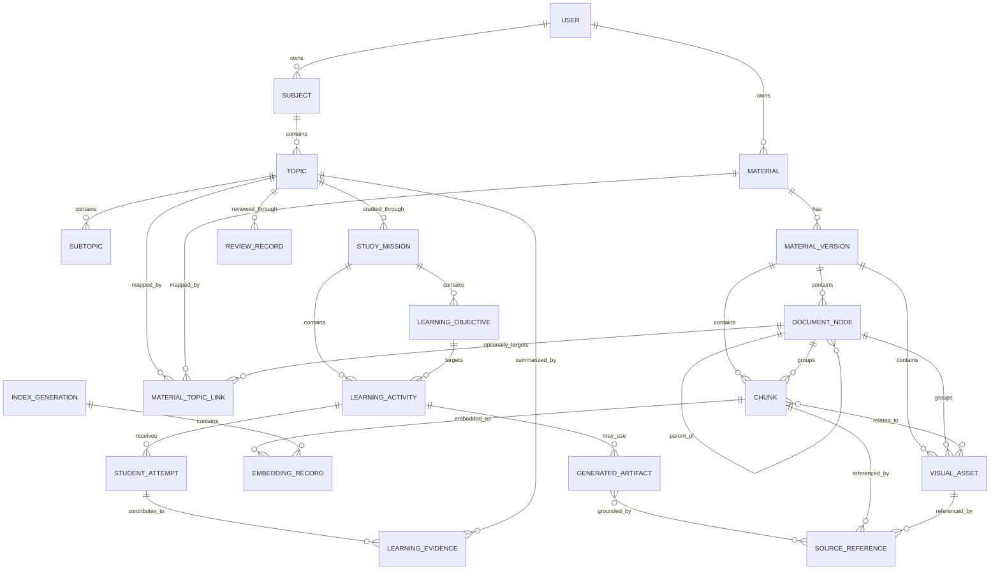
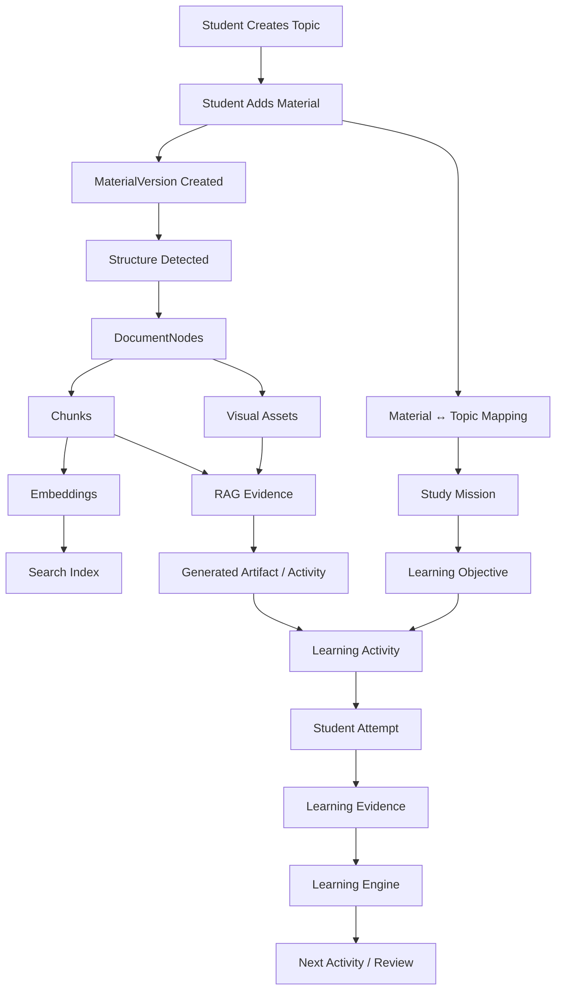
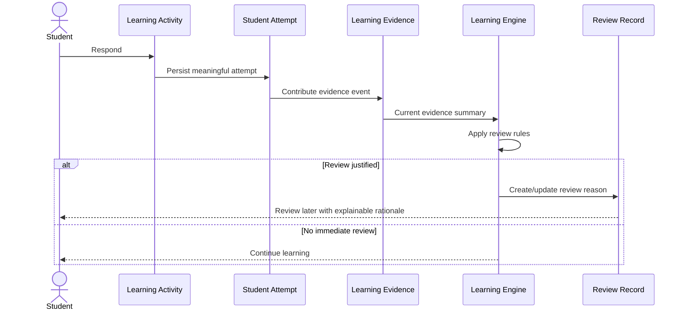

# 14 - Knowledge Base Design

## 1. Purpose

This document defines how Hippocampus organizes persistent knowledge and learning evidence.

It answers:

> **How should Hippocampus represent what the student is learning, where the source knowledge came from, how source material relates to study topics, and what evidence has been produced about learning?**

The Knowledge Base is broader than a vector index and narrower than a universal medical ontology.

It exists to support:

- Student-centered organization
- Source provenance
- RAG retrieval
- Study Mission continuity
- Learning evidence
- Review
- Visual learning
- Generated artifact reuse
- Explainability
- Data integrity

---

# 2. Locked Knowledge Base Principle

> **Hippocampus does not need to own all medical knowledge. It needs to reliably organize what the student is learning, where that knowledge came from, how concepts relate to their study structure, and what learning evidence has been produced.**

For v1, Hippocampus should not attempt to model all diseases, drugs, anatomical structures, pathways, or medical ontologies as a complete knowledge graph.

The system should remain focused on the student's own learning context.

---

# 3. Three Connected Knowledge Structures

The v1 Knowledge Base is organized around three related structures.

## 3.1 Learning Structure

```text
Subject
   ↓
Topic
   ↓
Subtopic
```

This reflects how the student organizes study.

## 3.2 Source Structure

```text
Material
   ↓
Material Version
   ↓
Document Hierarchy
   ↓
Chapter / Section / Subsection
   ↓
Chunk / Visual Asset
```

This reflects how source material is organized.

## 3.3 Learning Evidence Structure

```text
Study Mission
   ↓
Learning Objective
   ↓
Learning Activity
   ↓
Student Attempt
   ↓
Learning Evidence
   ↓
Review Evidence
```

These structures intersect but must not be conflated.

---

# 4. Core Relationship Model

```text
MEDICAL LEARNING STRUCTURE

Subject
   ↓
Topic
   ↓
Subtopic

        ↕ mapped to

SOURCE STRUCTURE

Material
   ↓
Material Version
   ↓
Chapter
   ↓
Section
   ↓
Chunk / Visual

        ↕ used by

LEARNING STRUCTURE

Study Mission
   ↓
Learning Objective
   ↓
Activities
   ↓
Attempts
   ↓
Learning Evidence
```

---

# 5. Core Entity Set

The conceptual v1 entity set includes:

```text
User
Subject
Topic
Subtopic
Material
MaterialVersion
DocumentNode
Chunk
VisualAsset
MaterialTopicLink
EmbeddingRecord
IndexGeneration
StudyMission
LearningObjective
LearningActivity
StudentAttempt
LearningEvidence
MisconceptionEvidence
ReflectionEvidence
ReviewRecord
GeneratedArtifact
SourceReference
```

These are conceptual entities.

Exact physical tables and classes are deferred to database/backend design.

---

# 6. User

The User owns or is authorized to access:

- Subjects
- Topics
- Materials
- Study Missions
- Learning Evidence
- Generated artifacts
- Review records

Cross-user access must not occur unless a future explicit sharing model is introduced.

For v1:

> **User isolation is the default.**

---

# 7. Subject

A Subject represents a high-level learning area.

Examples:

```text
Anatomy
Physiology
Biochemistry
Histology
Pathology
Pharmacology
Microbiology
```

A Subject belongs to a User.

A Subject contains Topics.

---

# 8. Topic

A Topic is a student-facing unit of study.

Examples:

```text
Brachial Plexus
Cardiac Action Potential
Renal Clearance
Glycolysis
```

A Topic belongs to a Subject.

A Topic may:

- Use multiple materials
- Map to multiple source sections
- Have multiple Study Missions
- Have multiple Learning Objectives
- Accumulate learning evidence over time

---

# 9. Subtopic

A Subtopic is an optional child of a Topic.

Example:

```text
Topic: Brachial Plexus

Subtopics:
- Roots
- Trunks
- Divisions
- Cords
- Terminal Branches
```

v1 should support subtopics conceptually but should not require deep arbitrary nesting.

The student experience should remain simple.

---

# 10. Material

A Material represents a student-provided source.

Examples:

- PDF
- Image
- Text notes
- Transcript
- Video-derived transcript source

A Material is **not** a Topic.

A Material may contain many topics.

---

# 11. MaterialVersion

Material content must be versioned.

Conceptually:

```text
Material
   ↓
MaterialVersion
```

A MaterialVersion preserves:

- Original source identity
- Version number / identifier
- Processing state
- Created timestamp
- File metadata
- Extraction diagnostics
- Active/inactive status

Chunks, visuals, and embeddings belong to a specific MaterialVersion.

---

# 12. Material Version Rule

> **Chunks and embeddings from different material versions must not be silently mixed.**

If a student replaces a source:

```text
Lecture v1
    ↓
Lecture v2
```

v2 receives a new processing/index generation.

Historical learning evidence may retain provenance to v1.

---

# 13. DocumentNode

A DocumentNode represents hierarchical source structure.

Possible node types:

```text
DOCUMENT
CHAPTER
SECTION
SUBSECTION
HEADING
PAGE_GROUP
TRANSCRIPT_SEGMENT_GROUP
```

Example:

```text
Physiology Textbook
└── Chapter 10
    └── SA Node
        └── Automatic Rhythmicity
```

DocumentNodes should preserve parent-child relationships.

---

# 14. Large Textbook Representation

A 600-page textbook can be represented as:

```text
Material
└── MaterialVersion
    ├── Chapter 1
    │   ├── Section 1.1
    │   └── Section 1.2
    ├── Chapter 2
    │   ├── Section 2.1
    │   └── Section 2.2
    ...
    └── Chapter 40
```

Chunks and visuals attach to the appropriate hierarchy nodes.

The entire textbook is not represented as one Topic.

---

# 15. MaterialTopicLink

A MaterialTopicLink creates the many-to-many relationship between student learning structure and source structure.

Example:

```text
Topic:
Brachial Plexus

Materials:
- Anatomy Lecture.pdf
- Moore.pdf
- Notes.txt
- Diagram.png
```

And:

```text
Material:
Physiology Textbook.pdf

Mapped Topics:
- Cardiac Action Potential
- Cardiac Cycle
- Blood Pressure
- Renal Physiology
```

The link may optionally point to:

- Whole Material
- Specific MaterialVersion
- DocumentNode / section
- Page range
- Specific source region

---

# 16. Mapping Origin

A MaterialTopicLink should preserve how it was created.

Possible origins:

```text
USER_SELECTED
STRUCTURE_DETECTED
SYSTEM_SUGGESTED
AI_ASSISTED
```

AI-assisted mapping must not become invisible truth.

Where appropriate, the student should be able to confirm/use the detected structure.

---

# 17. Chunk

A Chunk is a retrievable textual evidence unit.

It should preserve:

- Stable chunk ID
- Material ID
- MaterialVersion ID
- DocumentNode ID
- Page / timestamp
- Heading path
- Content
- Content type
- Extraction method
- Related visuals
- Source ordering
- Processing diagnostics

A Chunk is not itself a learner-facing Topic.

---

# 18. Chunk Provenance

Every Chunk must resolve to:

```text
Chunk
 ↓
DocumentNode
 ↓
MaterialVersion
 ↓
Material
 ↓
Original Student Source
```

This enables:

- Source citations
- Debugging
- RAG evaluation
- Material replacement
- Trust

---

# 19. VisualAsset

A VisualAsset represents source visual evidence.

Examples:

- Anatomy diagram
- Histology image
- Pathology image
- Radiology image
- Flow diagram
- Table rendered as image
- Chart
- Slide figure

A VisualAsset should preserve:

- MaterialVersion
- Page / source position
- Caption
- Nearby text
- Parent DocumentNode
- Original file reference
- Interpretation status
- Relevant Chunk links

---

# 20. Visual-Text Relationship

Visuals and text should support many-to-many association where needed.

Example:

```text
Visual 12
 ↔ Chunk 45
 ↔ Chunk 46
 ↔ Section: Posterior Cord
```

This supports RAG returning an Evidence Package containing both text and the original source image.

---

# 21. SourceReference

A SourceReference is a stable machine-to-source mapping.

Conceptually:

```text
SourceReference
├── materialId
├── materialVersionId
├── documentNodeId
├── chunkId?
├── visualId?
├── page?
├── timestamp?
└── displayLabel
```

Example learner-facing label:

```text
Upper Limb Lecture
Page 14
Posterior Cord
```

---

# 22. EmbeddingRecord

Embedding vectors should be represented separately from source identity.

Conceptually:

```text
EmbeddingRecord
├── chunkId
├── embeddingModel
├── embeddingVersion
├── dimension
├── indexGeneration
└── indexedAt
```

This supports safe re-indexing.

---

# 23. IndexGeneration

When embedding configuration changes:

```text
Index Generation 1
embedding model A

Index Generation 2
embedding model B
```

The system should not mix incompatible vectors.

An IndexGeneration may include:

- Model identifier
- Model version
- Dimension
- Chunking configuration version
- Index status
- Activation timestamp

---

# 24. Evidence Package Relationship

RAG does not persist an Evidence Package as the canonical source unless a specific audit/debug need justifies it.

An Evidence Package is generally assembled from persistent knowledge-base records:

```text
Chunks
+
VisualAssets
+
SourceReferences
+
Retrieval Metadata
+
Limitations
        ↓
Evidence Package
```

The Evidence Package is a retrieval-time contract.

Its components retain persistent identities.

---

# 25. StudyMission

A StudyMission represents one bounded guided learning session.

It belongs to:

- User
- Topic
- Optional Subtopic
- One or more Learning Objectives

It may reference:

- Selected Materials
- Selected DocumentNodes
- Learning evidence
- Generated educational artifacts

---

# 26. LearningObjective

A LearningObjective represents the specific educational goal for a mission or activity.

Examples:

```text
Explain the phases of the ventricular action potential.
Identify the terminal branches of the brachial plexus.
Apply posterior-cord anatomy to wrist-drop findings.
```

LearningObjectives connect educational intent to generated activities and evidence.

---

# 27. LearningActivity

A LearningActivity represents a concrete Study Mission step.

Possible activity types:

```text
UNDERSTAND
RETRIEVE
CONNECT
APPLY
VISUAL
FEEDBACK
REFLECT
```

A LearningActivity may reference:

- LearningObjective
- GeneratedArtifact
- SourceReferences
- Activity type
- Difficulty
- Mission stage
- Sequence position
- Completion state

---

# 28. GeneratedArtifact

A GeneratedArtifact stores AI-generated educational content when persistence is useful.

Possible types:

```text
EXPLANATION
QUESTION
CONCEPT_CONNECTION
APPLICATION_SCENARIO
FEEDBACK
SOURCE_SUMMARY
```

Not every AI response must be permanently stored.

Persistence should be purposeful.

---

# 29. Generated Artifact Provenance

A persisted GeneratedArtifact should preserve:

```text
artifactType
promptId
promptVersion
modelId
modelVersion
groundingMode
sourceReferences
createdAt
validationStatus
```

This supports:

- Reuse
- Quality review
- Regression analysis
- Prompt evaluation
- Explainability

---

# 30. Persistence vs Ephemeral AI Output

Persist when an AI output contributes to:

- Study Mission continuity
- Learning evidence
- Review
- Reuse
- Audit/debug needs
- Student-visible history

Prefer ephemeral use when the output is:

- Disposable wording
- Temporary reformulation
- Non-essential transient interaction

Avoid storing every generated token forever.

This supports data minimization.

---

# 31. StudentAttempt

A StudentAttempt records a learner response to a LearningActivity.

Conceptually:

```text
StudentAttempt
├── activityId
├── userId
├── response
├── attemptNumber
├── submittedAt
├── deterministicResult?
├── aiEvaluationArtifactId?
└── evaluationStatus
```

The exact raw-response retention policy will be defined later.

---

# 32. LearningEvidence

LearningEvidence represents an application-owned interpretation of meaningful attempt history.

Examples:

```text
Recall: STRONG
Application: WEAK
Visual Identification: DEVELOPING
```

Possible evidence dimensions:

- Retrieval
- Explanation
- Connection
- Application
- Visual identification
- Review retention

LearningEvidence is not an LLM opinion.

---

# 33. Learning Evidence Rule

> **The Knowledge Base stores learning evidence. The Learning Engine interprets it and decides the next educational action.**

The database does not independently decide mastery.

The LLM does not independently decide mastery.

---

# 34. Evidence State

Recommended broad evidence states:

```text
STRONG
DEVELOPING
WEAK
INSUFFICIENT_EVIDENCE
```

These should remain explainable and should not imply scientifically exact mastery percentages.

---

# 35. Evidence Provenance

LearningEvidence should be traceable to meaningful events.

Conceptually:

```text
LearningEvidence
     ↓
Evidence Events
     ↓
Student Attempts
     ↓
Learning Activities
     ↓
Learning Objectives
```

This allows the system to explain:

> Why is application considered weak?

---

# 36. MisconceptionEvidence

Misconceptions deserve explicit representation because they may drive targeted remediation.

Example:

```text
Topic:
Brachial Plexus

Concept:
Posterior Cord

Observed Misconception:
Student links wrist drop directly to posterior cord but cannot identify
the radial nerve relationship.
```

MisconceptionEvidence should preserve:

- Concept
- Source attempt
- Status
- First observed
- Last observed
- Resolved / unresolved where supported

Avoid treating one ambiguous answer as permanent misconception.

---

# 37. ReflectionEvidence

Reflection inputs may include:

- Confidence
- Remaining confusion
- Perceived difficulty

ReflectionEvidence is secondary evidence.

It must not override observed performance.

---

# 38. Confidence Evidence

Example:

```text
High Confidence + Incorrect Application
        ↓
Potential confidence-performance mismatch
```

The Knowledge Base stores the signals.

The Learning Engine decides whether they matter for the next action.

---

# 39. ReviewRecord

A ReviewRecord tracks intentional spaced relearning.

It may preserve:

- Topic / concept
- Reason for review
- Triggering evidence
- Scheduled/eligible time
- Review completion
- Review attempts
- Updated evidence
- Next review state

The exact scheduling algorithm is deferred.

---

# 40. Review Provenance

Review rationale should resolve to learning evidence.

Example:

```text
Review Reason:
Application Weak

Based On:
Attempt 15
Attempt 19
```

Not:

```text
LLM decided this needs review.
```

---

# 41. Topic-Level Evidence

Topic-level summaries may be computed from concept/activity evidence.

Example:

```text
Brachial Plexus

Recall: Strong
Connection: Developing
Application: Weak
```

Topic-level summaries should not destroy the underlying evidence trail.

---

# 42. Concept Identity in v1

Hippocampus needs some concept identity to track learning evidence, but v1 should avoid constructing a complete medical ontology.

Concept identity may initially be represented through:

- LearningObjective
- Topic/Subtopic
- Normalized concept labels
- Source-associated concept tags

Example:

```text
conceptKey: posterior-cord
displayName: Posterior Cord
```

This may later evolve.

---

# 43. What v1 Should Not Model

Do not prematurely create a universal hierarchy such as:

```text
Disease
Drug
Gene
Protein
AnatomicalStructure
Pathway
Procedure
Syndrome
MedicalOntologyNode
```

unless a specific v1 requirement demands it.

That would significantly expand scope.

---

# 44. Future Knowledge Graph Compatibility

The design should remain extensible so that future versions may introduce:

```text
Concept
 ↓
ConceptRelationship
 ↓
Medical Knowledge Graph
```

without replacing the existing Material, Topic, Chunk, and LearningEvidence models.

Future knowledge graphs should augment—not erase—source provenance.

---

# 45. Large PDF Example

Example source:

```text
Guyton Physiology.pdf
600+ pages
```

Knowledge Base representation:

```text
Material: Guyton Physiology
└── MaterialVersion: v1
    ├── Chapter: Cardiac Muscle
    │   ├── Section: Ventricular Action Potential
    │   │   ├── Chunk A
    │   │   ├── Chunk B
    │   │   └── Visual: Action Potential Diagram
    │   └── Section: Excitation-Contraction Coupling
    ├── Chapter: Rhythmical Excitation
    │   └── Section: SA Node
    └── Chapter: ECG
        └── Section: QRS Complex
```

Student learning structure:

```text
Subject: Physiology

Topics:
- Cardiac Action Potential
- SA Node
- ECG
```

MaterialTopicLinks associate the relevant source nodes to each Topic.

---

# 46. Multiple Sources Example

```text
Topic:
Cardiac Action Potential

Evidence Sources:
├── Physiology Lecture.pdf
│   └── Slides 25-32
├── Guyton.pdf
│   └── Chapter 9 / relevant section
├── Professor Notes.txt
│   └── Cardiac electrophysiology
└── action-potential-diagram.png
```

All sources remain independent and traceable.

---

# 47. Source Priority

The Knowledge Base should preserve source identity but should not permanently hard-code one source as universally authoritative.

Source selection may depend on:

- Student-selected material
- Current Study Mission
- Retrieval mode
- Recency/version
- Explicit professor-source preference

The Learning Engine/RAG layer decides runtime scope.

---

# 48. Subject / Topic Reorganization

Students may reorganize topics after ingestion.

Example:

```text
Cardiovascular Physiology
```

may later be split into:

```text
Cardiac Electrophysiology
Cardiac Cycle
Blood Pressure
```

Source chunks should not need to be recreated merely because user-facing topic organization changed.

MaterialTopicLinks can be updated.

This is a major benefit of separating Material from Topic.

---

# 49. Topic Deletion

Deleting a Topic should not automatically delete source Material.

Example:

```text
Delete Topic: SA Node
```

should normally remove:

- Topic-specific mapping
- Topic-specific mission/evidence relationships according to retention rules

but not:

```text
Delete entire Physiology textbook
```

unless explicitly requested.

---

# 50. Material Deletion

Deleting a Material should affect:

- Active MaterialVersion
- Chunks
- Embeddings
- Visual retrieval references
- MaterialTopicLinks

Historical GeneratedArtifacts/LearningEvidence that depended on the material require a defined retention/provenance policy.

At minimum, the system should not leave active retrieval references pointing to deleted material.

---

# 51. Generated Artifact Reuse

A grounded explanation may be reusable if:

- Same source version
- Same concept/objective
- Same grounding mode
- No learner-specific feedback dependence
- Prompt/model version remains acceptable

A personalized feedback artifact should usually not be reused for another learner or context.

---

# 52. Question Reuse

Validated question pools may be persisted.

Question reuse should consider:

- Topic
- Concept
- Difficulty
- Source version
- Prior exposure
- Intentional repetition
- Validation status

The anti-repetition engine uses history to avoid accidental duplicates.

---

# 53. Source-Grounded Artifact Classification

Persisted artifacts should conceptually carry:

```text
SOURCE_DERIVED
SOURCE_GROUNDED_GENERATED
SUPPLEMENTAL_GENERATED
GENERAL_GENERATED
```

Unsupported outputs should not be promoted to validated reusable artifacts.

---

# 54. Knowledge Base Query Patterns

The design should support queries such as:

### Learning Structure

```text
Give me all topics under Anatomy.
```

### Source Mapping

```text
Which materials support Brachial Plexus?
```

### Source Structure

```text
What sections were detected in this 600-page textbook?
```

### RAG

```text
Give me allowed chunks for SA Node from the selected materials.
```

### Visual

```text
Give me visuals related to Posterior Cord.
```

### Learning Evidence

```text
What evidence shows this student's application is weak?
```

### Review

```text
Which concepts are eligible for review and why?
```

---

# 55. Knowledge Base Integrity Rules

The following must remain true.

1. Every Chunk belongs to exactly one MaterialVersion.
2. Every VisualAsset belongs to exactly one MaterialVersion.
3. Every active embedding references valid source evidence.
4. Every active source reference resolves to an existing source.
5. Material versions do not silently share incompatible embeddings.
6. Topic deletion does not implicitly delete unrelated materials.
7. Material deletion removes active retrieval eligibility.
8. LearningEvidence traces back to meaningful evidence events.
9. GeneratedArtifact provenance is retained when persistence is required.
10. Cross-user source access is prohibited by default.
11. Review reasons trace to application-owned evidence.
12. Completion does not create mastery automatically.

---

# 56. Cross-User Isolation

Every user-owned knowledge record should preserve ownership or an equivalent authorized scope.

At minimum, isolation applies to:

- Materials
- Material versions
- Chunks
- Visuals
- Topic mappings
- Missions
- Attempts
- Learning evidence
- Generated artifacts
- Review records

Retrieval filters must enforce this ownership before data reaches AI.

---

# 57. Data Minimization

The Knowledge Base should store only what is necessary for:

- Product functionality
- Learning continuity
- Review
- Quality
- Diagnostics
- Safety

Avoid storing arbitrary conversational history merely because it exists.

---

# 58. Knowledge Base and AI Memory

The LLM's context window is not the Knowledge Base.

Persistent memory is:

```text
Database / Knowledge Base
+
Source Index
+
Learning Evidence
```

At runtime, only relevant information is selected into model context.

This supports:

- Cost efficiency
- Reliability
- Model replacement
- User continuity

---

# 59. Conceptual ER Diagram



This is conceptual and should not yet be treated as a physical database schema.

---

# 60. End-to-End Knowledge Flow



---

# 61. Evidence-to-Review Flow



---

# 62. Storage Boundary

The Knowledge Base conceptually spans three persistence concerns.

## 62.1 Relational / Metadata Persistence

Best suited to structured relationships such as:

- Users
- Subjects
- Topics
- Materials
- Material versions
- Document hierarchy
- Learning evidence
- Missions
- Attempts
- Review records
- Artifact metadata

## 62.2 File / Object Persistence

Best suited to:

- Original PDFs
- Original images
- Extracted figures
- Other binary source assets

## 62.3 Search / Vector Persistence

Best suited to:

- Chunk embeddings
- Searchable chunk fields
- Retrieval metadata

Exact technologies are deferred.

For the approximately 40-user MVP, simplicity is preferred.

---

# 63. v1 Persistence Philosophy

Do not create separate infrastructure solely because each conceptual domain exists.

For MVP:

> **Logical separation is required; distributed physical separation is not.**

Many responsibilities may safely live in:

- One relational database
- One file/object storage location
- One vector-capable search strategy

until scale or operational evidence demands otherwise.

---

# 64. MVP Knowledge Base Scope

v1 should support:

- User-owned Subjects
- Topics
- Optional Subtopics
- Materials
- MaterialVersions
- Document hierarchy
- Large multi-topic source representation
- Material-to-Topic many-to-many mapping
- Chunks
- Visual assets
- Stable source references
- Embedding/index metadata
- Study Missions
- Learning Objectives
- Learning Activities
- Student Attempts
- Learning Evidence
- Basic Misconception Evidence
- Reflection Evidence
- Review Records
- Selected GeneratedArtifacts
- Provenance
- Deletion/lifecycle integrity
- Cross-user isolation

---

# 65. Deferred Knowledge Base Capabilities

Not required for v1:

- Universal medical ontology
- Comprehensive medical knowledge graph
- Drug-disease graph
- Anatomical ontology engine
- Automated ontology reconciliation
- Advanced semantic concept graph
- Institutional/shared knowledge bases
- Faculty-curated libraries
- Cross-user sharing
- Social content
- Federated medical content
- Large-scale graph database

These may be evaluated after MVP validation.

---

# 66. Locked v1 Knowledge Base Decisions

The following decisions are approved for v1:

1. The Knowledge Base is not merely the vector index.
2. The Knowledge Base organizes learning structure, source structure, and learning evidence.
3. Hippocampus does not attempt to own all medical knowledge in v1.
4. Subject, Topic, and Subtopic represent student-facing learning organization.
5. Material is separate from Topic.
6. Material-to-Topic relationships are many-to-many.
7. Large textbooks are represented through hierarchical source structure.
8. MaterialVersion owns extracted/indexed evidence.
9. Old and new source versions must not silently mix.
10. DocumentNode preserves chapters, sections, and subsections.
11. Chunk is a source evidence unit, not a Topic.
12. VisualAsset is first-class evidence.
13. Text and visuals preserve relationships.
14. SourceReference resolves generated/source-grounded content to the original material.
15. Embedding metadata is versioned independently from source identity.
16. Index generations prevent incompatible embedding mixtures.
17. Evidence Packages are runtime retrieval contracts assembled from persistent source records.
18. StudyMission is the bounded session context.
19. LearningObjective represents explicit educational intent.
20. LearningActivity represents one mission activity.
21. StudentAttempt records meaningful learner responses.
22. LearningEvidence is application-owned.
23. LearningEvidence is not synonymous with mastery.
24. Broad evidence labels are preferred over false precision.
25. Misconceptions may be represented explicitly but require evidence.
26. Reflection/confidence is secondary evidence.
27. Review records trace back to learning evidence.
28. Generated artifacts are persisted only when product value justifies storage.
29. Persisted generated artifacts retain prompt/model/source provenance.
30. Full conversational history is not the canonical memory store.
31. User-owned knowledge remains isolated by default.
32. Topic reorganization should not require reprocessing source materials.
33. Topic deletion should not automatically delete unrelated materials.
34. Material deletion must remove active retrieval eligibility.
35. No active orphan vectors or source references are allowed.
36. v1 remains compatible with future concept graphs without requiring one now.
37. Logical domain separation does not require microservices or distributed storage.
38. MVP persistence should remain simple enough for approximately 40 users.

---

# 67. Out of Scope

This document does not define:

- Exact SQL schema
- Exact table names
- Exact Java entities
- Exact ORM choice
- Exact database engine
- Exact vector database
- Exact object storage provider
- Exact indexes
- Exact foreign-key definitions
- Exact deletion retention duration
- Exact mastery formula
- Exact review algorithm
- Exact concept normalization algorithm

These belong to later backend/database architecture.

---

# 68. Related Documents

- 00 - Project Vision
- 01 - Guiding Principles
- 02 - Problem Statement
- 03 - Educational Foundation
- 04 - Product Requirements
- 05 - User Personas
- 06 - User Journey & Learning Flow
- 07 - Feature Specifications
- 08 - Non-Functional Requirements
- 09 - MVP Scope & Roadmap
- 10 - AI Architecture
- 11 - AI Learning Engine
- 12 - Prompt Engineering Strategy
- 13 - RAG Architecture
- 15 - AI Evaluation Strategy

---

# 69. Next Document

**15 - AI Evaluation Strategy**

The next document should define how Hippocampus validates:

- Medical correctness
- Groundedness
- Source fidelity
- Prompt quality
- Retrieval quality
- Question quality
- Response-evaluation quality
- Clinical scenario quality
- Learner-level appropriateness
- Visual AI behavior
- Safety
- Token efficiency
- Latency
- Regression

It should establish the evidence required before an AI capability or prompt/model version is considered production-ready.

---

# 70. Revision History

| Version | Date | Author | Changes |
|---|---|---|---|
| 1.0.0 | 2026-08-23 | Project Hippocampus Team | Initial finalized Knowledge Base Design defining student learning structure, source structure, learning evidence, material-topic separation, provenance, generated artifact storage, lifecycle, and v1 boundaries |

---

# 71. Approval

**Status:** Final

**Reviewed By:** Project Hippocampus Team

**Approved By:** Project Hippocampus Team
